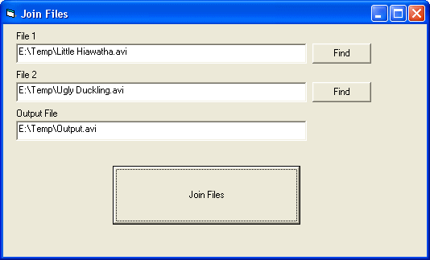



## Join Files

### Description

This is a simple and efficient code to join any type of file, small or large, as TXT, AVI, MPEG, WMV, MP3, etc.. Please vote!
 
### More Info
 

             |
---                |---
**Submitted On**   |2008-09-17 09:50:02
**By**             |[Eleusmario Mariano Rabelo](https://github.com/Planet-Source-Code/PSCIndex/blob/master/ByAuthor/eleusmario-mariano-rabelo.md)
**Level**          |Intermediate
**User Rating**    |5.0 (10 globes from 2 users)
**Compatibility**  |VB 5\.0, VB 6\.0
**Category**       |[Files/ File Controls/ Input/ Output](https://github.com/Planet-Source-Code/PSCIndex/blob/master/ByCategory/files-file-controls-input-output__1-3.md)
**World**          |[Visual Basic](https://github.com/Planet-Source-Code/PSCIndex/blob/master/ByWorld/visual-basic.md)
**Archive File**   |[Join\_Files2127289172008\.zip](https://github.com/Planet-Source-Code/eleusmario-mariano-rabelo-join-files__1-71093/archive/master.zip)

